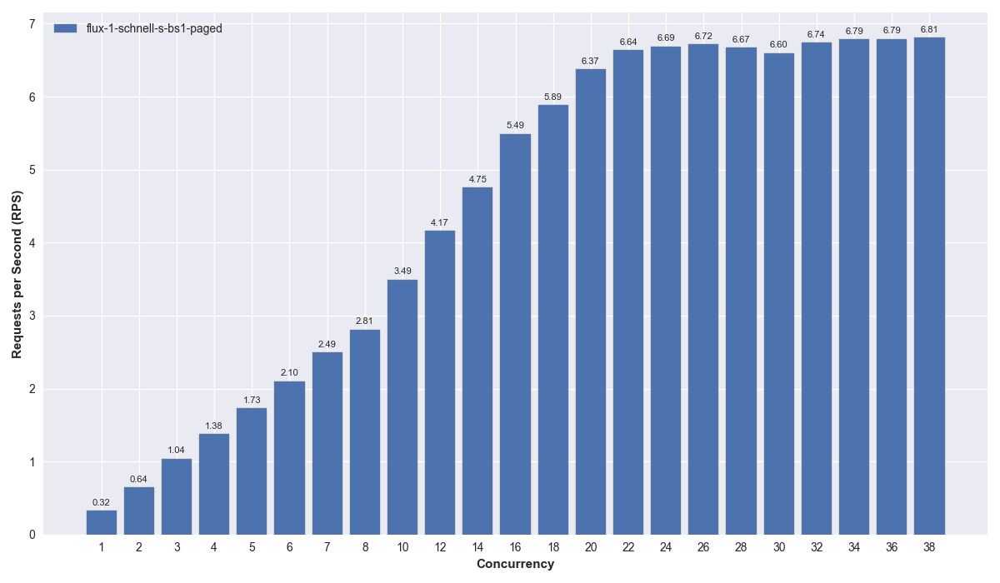
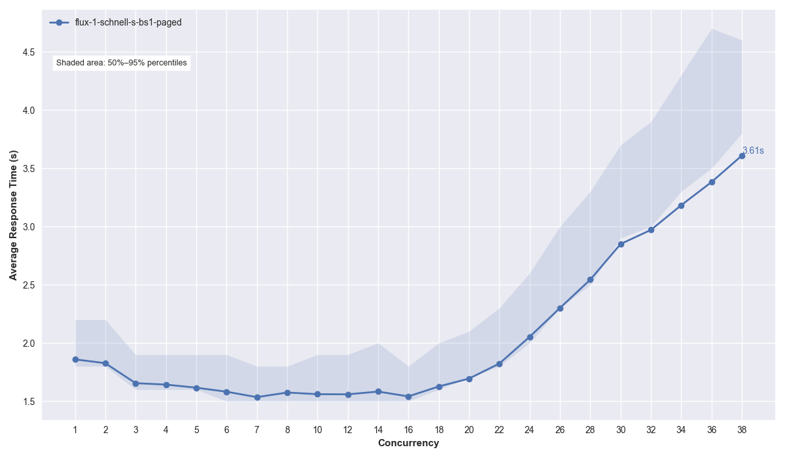

# Benchmark

## Setup

- Recipe "FLUX.1-schnell (S) – TheStage"
- Cluster
  - Priority: High
  - 8 replicas
- Benchmark
  - Tool 
    - TheStage elastic-models library benchmark (locust wrapper)
  - Concurrency
    - 1,2,3,4,5,6,7,8,10,12,14,16,18,20,22,24,26,28,30,32,34,36,38
  - Num Requests (overall for each concurrency value)
    - 1024
  - Model
    - Prompt: random
    - Resolution: 1024×1024
    - Steps: 4
    - Sampler: Euler
    - Scheduler: Simple
    - Batch Size: 1
  - Hardware
    - 5090 (32GB vram)
    - RAM: 8GB
    - vCPU: 4
    - Same region as the Container Group Machines
- Metrics:
  - Response Time: Total round-trip time for one request to generate an image and receive a response, as measured on my laptop.
  - RPS (Throughput): The number of requests succeeding per second for the entire cluster.

##### Plots





##### Data

See `data/results.csv` and `data/results.md` for aggregated benchmark results.

---

### How to reproduce

From a VDS/VPS from a reliable Data Center in the same region as your container group:

##### Run benchmarks:

`SALAD_ACCESS_DOMAIN_NAME` will have a value like `honeyberry-radicchio-d3abea3.salad.cloud`.
`AUTH_TOKEN` is the custom token you set during deployment to protect the inference endpoint.

```shell
docker run -it --rm \
  -v "$(pwd)/data:/tmp/data" \
  public.ecr.aws/i3f7g5s7/thestage/elastic-models-cli:0.0.18 \
    elastic-models-client \
      benchmark diffusion \
        --host "${SALAD_ACCESS_DOMAIN_NAME}" \
        --protocol "https" \
        --metadata-port 443 \
        --inference-url "https://${SALAD_ACCESS_DOMAIN_NAME}" \
        --authorization "${AUTH_TOKEN}" \
        --concurrency "1,2,3,4,5,6,7,8,10,12,14,16,18,20,22,24,26,28,30,32,34,36,38" \
        --num-requests 1024 \
        --log-jsonl \
        --log-level DEBUG \
        --output-dir /tmp/data
```

### Run notebook

Execute `report-speed.ipynb` to aggregate the results. Aggregated data will be available in the `./data` folder.

### Output Files

The benchmark generates the following files in the `./data` directory:
- `results.csv` - Aggregated benchmark results in CSV format
- `results.md` - Aggregated benchmark results in Markdown format  
- `report_*_*_*.csv` - Individual benchmark run statistics
- `report_*_*_*.json` - Individual benchmark run parameters
- Individual run files (HTML reports, output logs, etc.)