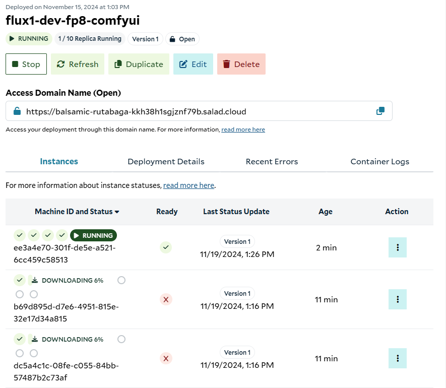
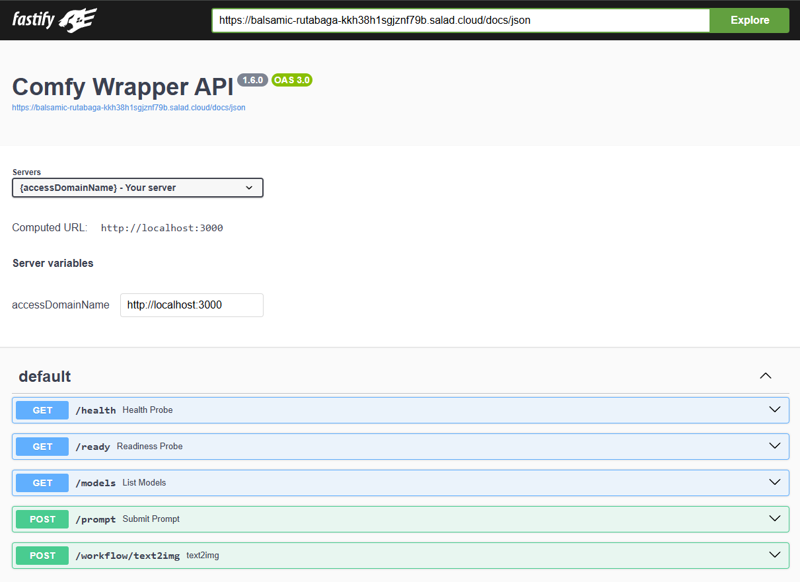

# Flux.1-Dev (FP8) - ComfyUI (API)

> **NOTE**: This model is released under a [non-commercial license](https://github.com/black-forest-labs/flux/blob/main/model_licenses/LICENSE-FLUX1-dev). For commercial use, please contact the model provider, [Black Forest Labs](https://blackforestlabs.ai/).


## Overview

This recipe creates an inference API for the [FLUX.1-Dev](https://huggingface.co/black-forest-labs/FLUX.1-dev)
image generation model by Black Forest Labs, specifically
[this FP8 version](https://huggingface.co/Comfy-Org/flux1-dev) provided by the Comfy Org. Inference is powered by
[ComfyUI](https://github.com/comfyanonymous/ComfyUI/), exposed via
[a simple HTTP API](https://github.com/SaladTechnologies/comfyui-api) to facilitate scalable stateless operation. Users
can make an HTTP request to the provided endpoints and get back one or more images in base64 encoded form. Optionally,
users can receive completed images via a webhook.

FLUX.1-Dev is notable for several features:

- High quality outputs
- Can generate legible text
- Can generate HD images in a variety of styles
- Has best-in-class prompt adherence, even for complex prompts
- Fine-tunable for a variety of use cases

### Example Output


```bash
curl -X 'POST' \
  "$access_domain_name/workflow/text2img" \
  -H 'accept: application/json' \
  -H 'Content-Type: application/json' \
  -d '{
  "input": {
    "prompt": "A beautiful sunset over the ocean",
  }
}' | jq -r '.images[0]' | base64 -d > image.png
```

## How To Use This Recipe

### Authentication

When deploying this recipe, you can optionally enable authentication in the container gateway. If you enable
authentication, all requests to your API will need to include your SaladCloud API key in the header `Salad-Api-Key`. See
the [documentation](/products/sce/gateway/sending-requests) for more information about authentication.

### Replica Count

The recipe is configured for 3 replicas by default, and we recommend using at least 3 for testing, and at least 5 for
production workloads. SaladCloud's distributed GPU cloud is powered by idle gaming PCs around the world, in private
residences, gaming cafes, and eSports arenas. A consequence of this unique infrastructure is that all nodes must be
considered interruptible without warning. If a Chef (a compute host) decides they want to use their GPU to play a video
game, or their dog trips on the power cord, or their Wi-Fi goes out, the instance of your workload running on that node
will be interrupted, and a new instance will be allocated to a different node. This means you will want to slightly
over-provision the capacity you expect to need in order to have adequate coverage during node reallocations. Don’t
worry, we only charge for instances that are actually running.

### Logging

SaladCloud offers a simple built-in method to view logs from the portal, to facilitate testing and development. For
production workloads, we highly recommend connecting an external logging source, such as Axiom. This can be done during
container group creation.

### Deploy It And Wait

When you deploy the recipe, SaladCloud will find the desired number of qualified nodes, and begin the process of
downloading the container image to the host machine. This particular image is quite large (~16 GB), and it may take up
to tens of minutes to download to some machines, depending on the network conditions of that particular node. Remember,
these are residential PCs with residential internet connections, and performance will vary across different nodes.

Eventually, you will see instances enter the running state, and show a green checkmark in the “Ready” column, indicating
the workload is passing its readiness probe. Once at least 1 instance is running, the container group will be considered
running, but for production you will want to wait until an adequate number of nodes have become ready before moving
traffic over.



### Visit The Docs

Once at least one instance is running, you can navigate to the `/docs` endpoint at the Access Domain Name provided in
the portal. In the above example that URL is `https://balsamic-rutabaga-kkh38h1sgjznf79b.salad.cloud/docs` . You’ll see the
swagger documentation that looks something like this:



## Workload Customizations

### Hardware Considerations

We recommend at least 24gb of system ram for this. When lowered to 16gb, we saw significantly increased variability in
response times, and a slightly elevated error rate. This is likely because the workload uses almost exactly 16gb ram,
occasionally going over and causing the generation to fail. The default system ram in this recipe is 30gb for optimal
performance.

We used the RTX 4090 with 24gb vRAM for optimal performance, but it will run on many other GPUs as well, although with
lower performance. If your workflow includes more models, such as an upscale model, you should choose a GPU with 24gb
vRAM.

You should conduct your own performance testing for your specific workload and hardware configuration.

### Custom Models And Nodes

To use a different model, you would follow
[this guide](/guides/image-generation/basic-how-to-deploy-flux-on-salad-comfy) but copy in your custom model instead of
the default one, and ensure your warmup workflow references the correct checkpoint name. You’d push up the new image to
the image registry of your choice, and edit the container group to reference the new image.

### Custom Endpoints

[Learn how to add custom workflows](https://github.com/SaladTechnologies/comfyui-api?tab=readme-ov-file#generating-new-workflow-endpoints)
to the API server.

## API Reference

You can see the full API documentation at the `/docs` endpoint at the Access Domain Name of your container group. They
can also be found in the [API Reference](/reference/recipes/flux1-schnell-fp8-comfyui/).
