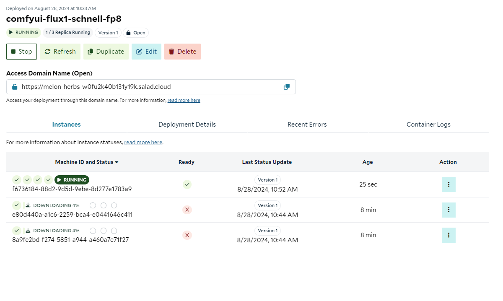
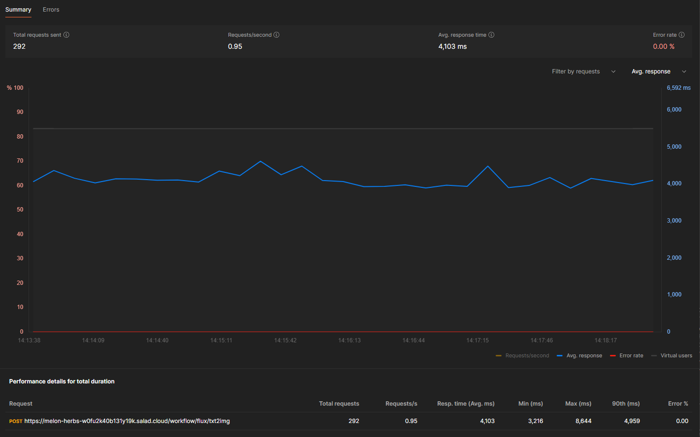
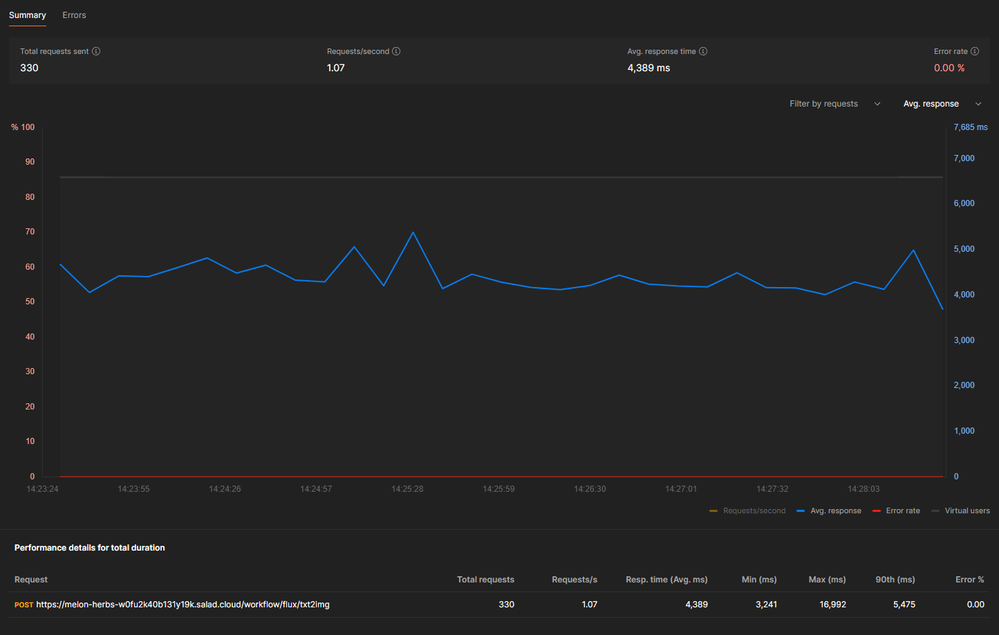
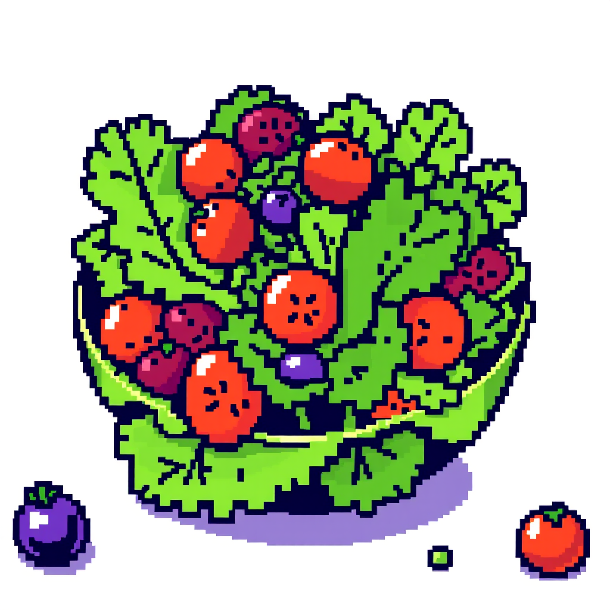

# FLUX.1-Schnell (FP8) - ComfyUI (API)

## What This Recipe Does

This recipe creates an inference API for the [FLUX.1-schnell](https://huggingface.co/black-forest-labs/FLUX.1-schnell) image generation model by Black Forest Labs, specifically [this FP8 version](https://huggingface.co/Comfy-Org/flux1-schnell) provided by the Comfy Org.
Inference is powered by [ComfyUI](https://github.com/comfyanonymous/ComfyUI/), exposed via [a simple HTTP API](https://github.com/SaladTechnologies/comfyui-api) to facilitate scalable stateless operation.
Users can make an HTTP request to the provided endpoints and get back one or more images in base64 encoded form.
Optionally, users can receive completed images via a webhook.

FLUX.1-Schnell is notable for several features:

- High quality outputs in only 4 steps
- Commercial-friendly Apache 2 license
- Can generate legible text
- Can generate HD images in a variety of styles
- Has best-in-class prompt adherence, even for complex prompts

### Example Output


```bash
curl -X 'POST' \
  "$access_domain_name/workflow/flux/txt2img" \
  -H 'accept: application/json' \
  -H 'Content-Type: application/json' \
  -d '{
  "input": {
    "prompt": "8-bit video game art of a salad"
  }
}' | jq -r '.images[0]' | base64 -d > image.png
```

## How To Use This Recipe

### Authentication

When deploying this recipe, you can optionally enable authentication in the container gateway.
If you enable authentication, all requests to your API will need to include your Salad API key in the header `Salad-Api-Key`.
See the [documentation](https://docs.salad.com/container-engine/gateway/sending-requests#authenticated-requests) for more information about authentication.

### Replica Count

The recipe is configured for 3 replicas by default, and we recommend using at least 3 for testing, and at least 5 for production workloads.
Salad’s distributed GPU cloud is powered by idle gaming PCs around the world, in private residences, gaming cafes, and esports arenas.
A consequence of this unique infrastructure is that all nodes must be considered interruptible without warning.
If a Chef (a compute host) decides they want to use their GPU to play a video game, or their dog trips on the power cord, or their Wi-Fi goes out, the instance of your workload running on that node will be interrupted, and a new instance will be allocated to a different node.
This means you will want to slightly over-provision the capacity you expect to need in order to have adequate coverage during node reallocations.
Don’t worry, we only charge for instances that are actually running.

### Logging

Salad offers a simple built-in method to view logs from the portal, to facilitate testing and development.
For production workloads, we highly recommend connecting an external logging source, such as Axiom.
This can be done during container group creation.

### Deploy It And Wait

When you deploy the recipe, Salad will find the desired number of qualified nodes, and begin the process of downloading the container image to the host machine.
This particular image is quite large (~16 GB), and it may take up to tens of minutes to download to some machines, depending on the network conditions of that particular node.
Remember, these are residential PCs with residential internet connections, and performance will vary across different nodes.

Eventually, you will see instances enter the running state, and show a green checkmark in the “Ready” column, indicating the workload is passing its readiness probe.
Once at least 1 instance is running, the container group will be considered running, but for production you will want to wait until an adequate number of nodes have become ready before moving traffic over.



### Visit The Docs

Once at least one instance is running, you can navigate to the `/docs` endpoint at the Access Domain Name provided in the portal.
In the above example that URL is `https://melon-herbs-w0fu2k40b131y19k.salad.cloud/docs` .
You’ll see the swagger documentation that looks something like this:


### API Endpoints

- `GET /health` - A healthcheck endpoint that indicates whether the server is up and warm.
This is used as our startup probe.
- `GET /ready` - A readiness endpoint that indicates whether the server is warm and ready to receive traffic.
This is used as our readiness probe.
- `GET /models` - Conveniently see what models are available.
- `POST /prompt` - This accepts a ComfyUI prompt in the API format.
This endpoint offers you the full flexibility of ComfyUI, as you can submit any valid json workflow.
For `LoadImage` nodes, you can include either a URL, or a Base64-encoded image as the image value.
- `POST /workflow/flux/txt2img` - This is a convenience endpoint that lets you submit as little as just the prompt and get an image back, without worrying about the complexities of the ComfyUI prompt workflow format.
- `POST /workflow/flux/img2img` - This is a convenience endpoint that lets you submit an img2img request using as little as the prompt and an image.
The image can be provided as either a URL or a Base64-encoded image.

## Workload Customizations

### Hardware Considerations

We recommend at least 24gb of system ram for this.
When lowered to 16gb, we saw significantly increased variability in response times, and a slightly elevated error rate.
This is likely because the workload uses almost exactly 16gb ram, occasionally going over and causing the generation to fail.
The default system ram in this recipe is 30gb for optimal performance.

We used the RTX 4090 with 24gb vRAM for optimal performance, but it will run on many other GPUs as well, although with lower performance.
If your workflow includes more models, such as an upscale model, you should choose a GPU with 24gb vRAM.

You should conduct your own performance testing for your specific workload and hardware configuration.

### Custom Models And Nodes

To use a different model, you would follow [this guide](https://docs.salad.com/container-engine/guides/stable-diffusion/basic-how-to-deploy-flux-on-salad-comfy) but copy in your custom model instead of the default one, and ensure your warmup workflow references the correct checkpoint name.
You’d push up the new image to the image registry of your choice, and edit the container group to reference the new image.

### Custom Endpoints

To add custom endpoints or other custom functionality to the API server, you will need to make some small customizations to the API executable.
To do this, you can [fork the repo](https://github.com/SaladTechnologies/comfyui-api/fork) and [learn how to add custom workflows](https://github.com/SaladTechnologies/comfyui-api?tab=readme-ov-file#generating-new-workflow-template-endpoints).

## Performance

**(Default Configuration) RTX 4090 24GB vRAM, 30GB System RAM, 4 vCPU**

We used Postman to [test the performance](https://blog.postman.com/postman-api-performance-testing/) of this recipe.
Each test request generated 1 image at 1024x1024 resolution.
We had 5 salad instances running for the benchmark, and simulated load from 5 simultaneous users for 5 minutes.



We can see the average total request time is about **4.1 seconds**, and that performance was relatively consistent, and **no errors** were encountered.
We saw throughput of **0.95 requests / second**.

We ran a second test with 6 simulated users on the same 5 instances.
We see average total request time is up a bit at about **4.4 seconds (+7.3%)**.
However, we also see that throughput is up to **1.07 requests / second (+12.6%)**, and error rate remained at **0**.



You should conduct your own performance testing to find the right balance for your users and your budget.

## API Reference

You can see the full API documentation at the `/docs` endpoint at the Access Domain Name of your container group.

### `POST /workflow/flux/txt2img` - Create An Image

**Request**

```shell
curl -X 'POST' \
  "$access_domain_name/workflow/flux/txt2img" \
  -H 'accept: application/json' \
  -H 'Content-Type: application/json' \
  -d '{
  "input": {
    "prompt": "8-bit video game art of a salad"
  }
}'
```

**Response**

```json
{
  "id": "3b0efe38-4d06-470e-88aa-9f891c193398",
  "input": {
    "prompt": "8-bit video game art of a salad",
    "width": 1024,
    "height": 1024,
    "seed": 253091131172871,
    "steps": 4,
    "cfg_scale": 1,
    "sampler_name": "euler",
    "scheduler": "simple",
    "denoise": 1,
    "checkpoint": "flux1-schnell-fp8.safetensors"
  },
  "prompt": {...},
  "images": ["base64image"]
}
```

Your generated image will be a base64-encoded string at `.images[0]` in the response body.



## HelpScout Beacon

- In this guide, we want to link to:
    - Link to Preset Container Guide:
    - Link to API Reference:
    - Link to GitHub ReadMe: