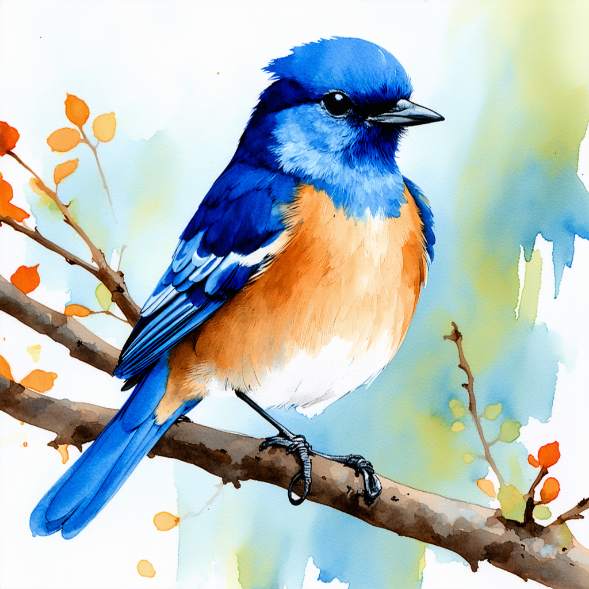
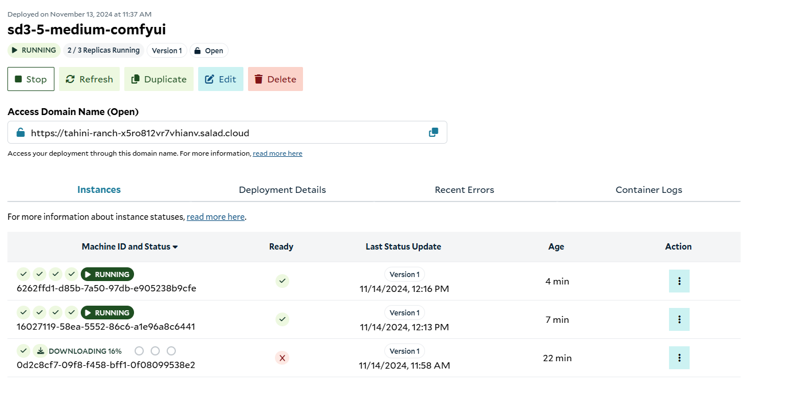
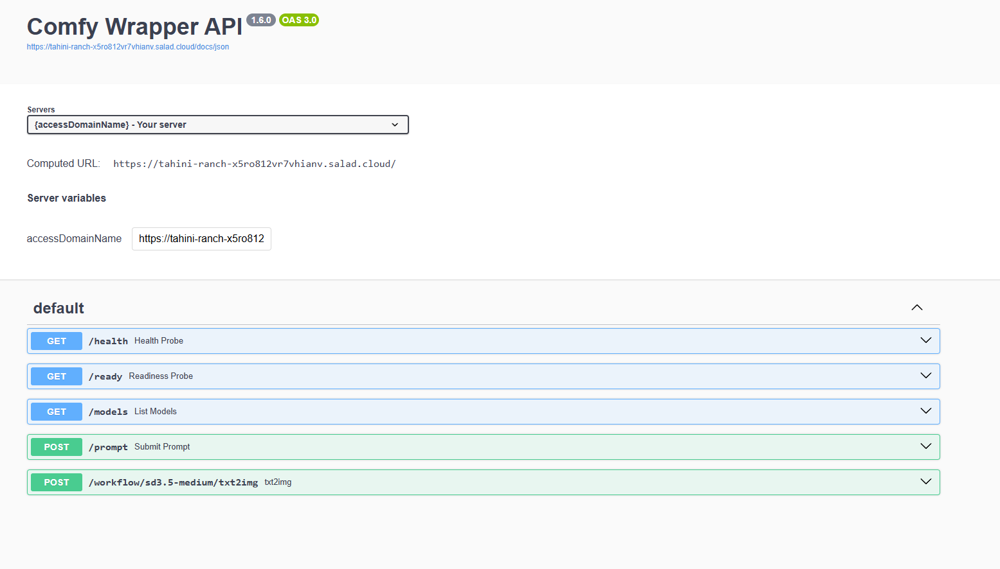

# Stable Diffusion 3.5 Medium

## What This Recipe Does

This recipe creates an inference API for [Stable Diffusion 3.5 Large](https://huggingface.co/stabilityai/stable-diffusion-3.5-medium) image generation model by Stability AI.
Inference is powered by [ComfyUI](https://github.com/comfyanonymous/ComfyUI/), exposed via [a simple HTTP API](https://github.com/SaladTechnologies/comfyui-api) to facilitate scalable stateless operation.
Users can make an HTTP request to the provided endpoints and get back one or more images in base64 encoded form.
Optionally, users can receive completed images via a webhook.

Stable Diffusion 3.5 Medium is a smaller model in the Stable Diffusion 3.5 model, and is capable of generating high-quality images across a wide variety of art styles.
It is faster than the larger model, though less capable in certain aspects.

- Great quality images
- Supports many different art styles
- [Stability Community License](https://stability.ai/news/license-update) - free for non-commercial use, and commercial use with revenue under $1M/year




```bash
curl -X 'POST' \
  "$access_domain_name/workflow/sd3.5-medium/txt2img" \
  -H 'accept: application/json' \
  -H 'Content-Type: application/json' \
  -d '{
  "input": {
    "prompt": "a leafy green spaceship from the distant future",
    "steps": 20
  }
}' | jq -r '.images[0]' | base64 -d > image.png
```

## How To Use This Recipe

### Authentication

When deploying this recipe, you can optionally enable authentication in the container gateway.
If you enable authentication, all requests to your API will need to include your Salad API key in the header `Salad-Api-Key`.
See the [documentation](https://docs.salad.com/container-engine/gateway/sending-requests#authenticated-requests) for more information about authentication.

### Replica Count

The recipe is configured for 3 replicas by default, and we recommend using at least 3 for testing, and at least 5 for production workloads.
Salad’s distributed GPU cloud is powered by idle gaming PCs around the world, in private residences, gaming cafes, and esports arenas.
A consequence of this unique infrastructure is that all nodes must be considered interruptible without warning.
If a Chef (a compute host) decides they want to use their GPU to play a video game, or their dog trips on the power cord, or their Wi-Fi goes out, the instance of your workload running on that node will be interrupted, and a new instance will be allocated to a different node.
This means you will want to slightly over-provision the capacity you expect to need in order to have adequate coverage during node reallocations.
Don’t worry, we only charge for instances that are actually running.

### Logging

Salad offers a simple built-in method to view logs from the portal, to facilitate testing and development.
For production workloads, we highly recommend connecting an external logging source, such as Axiom.
This can be done during container group creation.

### Deploy It And Wait

When you deploy the recipe, Salad will find the desired number of qualified nodes, and begin the process of downloading the container image to the host machine.
This image is relatively large (~23 GB), and it may take up to tens of minutes to download to some machines, depending on the network conditions of that particular node.
Remember, these are residential PCs with residential internet connections, and performance will vary across different nodes.

Eventually, you will see instances enter the running state, and show a green checkmark in the “Ready” column, indicating the workload is passing its readiness probe.
Once at least 1 instance is running, the container group will be considered running, but for production you will want to wait until an adequate number of nodes have become ready before moving traffic over.



### Visit The Docs

Once at least one instance is running, you can navigate to the `/docs` endpoint at the Access Domain Name provided in the portal.
In the above example that URL is `https://tahini-ranch-x5ro812vr7vhianv.salad.cloud/docs` .
You’ll see the swagger documentation that looks something like this:




## Workload Customizations

### **Hardware Considerations**

This model is quite large, and requires a significant amount of GPU memory. We recommend only using it on GPUs with 24gb of vRAM.
We chose the RTX 4090 with 24gb vRAM for the default recipe configuration because it offers the best performance for this model.
You should run your own performance testing to determine the hardware configuration that is right for your specific workload.

Additionally, this model requires a significant amount of RAM. The recipe is configured with 38gb of system RAM by default, which is sufficient for the model.
You may need more if your workflows involve additional models, processes, etc.

### Custom Models And Nodes

To use a different model, you would follow [this guide](https://docs.salad.com/container-engine/guides/stable-diffusion/basic-how-to-deploy-stable-diffusion-on-salad-comfy) but copy in your custom model instead of the default one, and ensure your warmup workflow references the correct checkpoint name.
You’d push up the new image to the image registry of your choice, and edit the container group to reference the new image.

### Custom Endpoints

[Learn how to add custom workflows](https://github.com/SaladTechnologies/comfyui-api?tab=readme-ov-file#generating-new-workflow-endpoints) to the API server.
