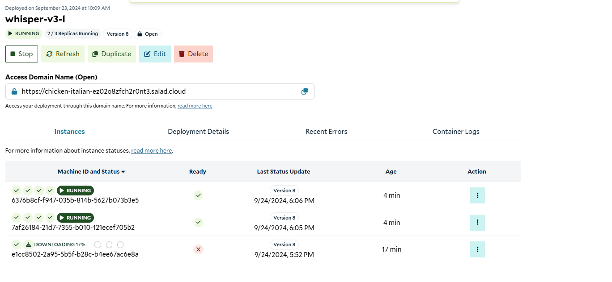

# Whisper v3 Large API

## What This Recipe Does

This recipe creates an inference API for speech-to-text transcription using the Whisper Large v3 model. The API can process audio files, downloadable links, and YouTube links. By utilizing a "chunked" algorithm, it maximizes processing speed to deliver fast and accurate transcriptions.

Users can customize API calls to enable translation to English and retrieve sentence-level timestamps. A list of supported file types and languages is available in the [whisper v3 model card](https://huggingface.co/openai/whisper-large-v3) The inference is powered by Whisper v3 and is exposed via a simple HTTP API.

Note: The API is configured as a live (synchronous) endpoint with a response window of 90 seconds. Please ensure your audio can be processed within this timeframe to prevent request timeouts.

### Key Features:
- `Transcription of ~99 languages`
- `Translation to English`
- `Fast processing`
- `High accuracy`

## How To Use This Recipe

### Authentication
By default, this API does not require authentication. However, authentication can be enabled via the container gateway. If enabled, all requests must include your Salad API key in the Salad-Api-Key header. Refer to the [Documentation](https://docs.salad.com/container-engine/gateway/sending-requests#authenticated-requests) for more information.

### Replica Count
The recipe is configured by default for 3 replicas, and we recommend using at least 3 nodes. Salad's distributed GPU cloud is powered by idle gaming PCs worldwide, which means nodes can be interrupted without warning (e.g., due to a machine being used for gaming). To ensure uptime during interruptions, over-provision your resources slightly beyond your expected needs.

### Logging
You can view logs directly from the Salad portal to facilitate testing and development. For production workloads, connect an external logging source such as Axiom during container group creation to monitor logs effectively.

### Deployment
When you deploy this API, Salad will allocate the desired number of qualified nodes, and the process of downloading the container image will begin. Depending on network conditions, downloading the container image may take several minutes. Once the nodes are up, the instances will enter the running state, showing a green checkmark in the "Ready" column. The API is ready to serve traffic once at least one instance is running, though you may want to wait until more nodes are active for production workloads.



### Accessing the Documentation
Once at least one instance is running, you can navigate to the /docs endpoint at the Access Domain Name provided in the portal. In the above example that URL is https://chicken-italian-ez02o8zfch2r0nt3.salad.cloud/docs . You’ll see the swagger documentation that looks something like this:


### API Endpoints

- `GET /health` - A health check endpoint that indicates whether the server is up and running. Useful for monitoring the server's status.
- `GET /ready` - Checks if the processor is ready to accept requests.
- `POST /transcribe/file` - Processes audio files uploaded from local storage..

**Request Parameters:**
file: The audio file, uploaded as form data.
timestamps: (Optional) Set to true to include sentence-level timestamps.
translate: (Optional) Set to true to translate the transcription to English.

```bash
curl -X POST "https://chicken-italian-ez02o8zfch2r0nt3.salad.cloud/transcribe/file" \
  -F "file=@temp.mp3" \
  -F "timestamps=false" \
  -F "translate=false"
```

- `POST /transcribe/url` - This endpoint processes a YouTube video URL or downloadable audio url for transcription.

**Request Parameters:**
url: The YouTube video URL or downloadable audio URL.
timestamps: (Optional) Set to true to include sentence-level timestamps.
translate: (Optional) Set to true to translate the transcription to English.

```bash
curl -X POST "https://chicken-italian-ez02o8zfch2r0nt3.salad.cloud/transcribe/url" -H "Content-Type: application/json" -d '{
  "url": "youtube link",
  "timestamps": false,
  "translate": false
}'
```

**Example Response:**

```json
{
  "transcription": {
    "text": "Full transcription text here.",
    "chunks": [
      {
        "timestamp": [0.0, 7.56],
        "text": "First sentence of the transcription."
      },
      {
        "timestamp": [8.66, 11.82],
        "text": "Second sentence of the transcription."
      }
      // Additional chunks...
    ]
  }
}


```
Note: Set "timestamps": true if you need sentence-level timestamps and "translate": true if you need to translate the text to English.

## Workload Customizations
### Hardware Considerations
For optimal performance, we recommend using a GPU with at least 12 GB VRAM for audio processing. Configuration will depend on your specific use case. For example, short audio files (under 30 seconds) can be processed efficiently with a 12 GB GPU, but longer audio files may require more powerful hardware. Refer to our [salad whisper benchmark](https://blog.salad.com/whisper-large-v3/) to make an informed decision.


### Scaling for Production
For production, we recommend setting the replica count to 5 or more to ensure coverage in case of node interruptions. Salad’s infrastructure ensures that your workloads are distributed across multiple GPU nodes, and interruptions are handled smoothly.

## Performance
### Default Configuration
Hardware: RTX 3080TI with 12 GB VRAM
System RAM: 12 GB
vCPU: 2 vCPUs
