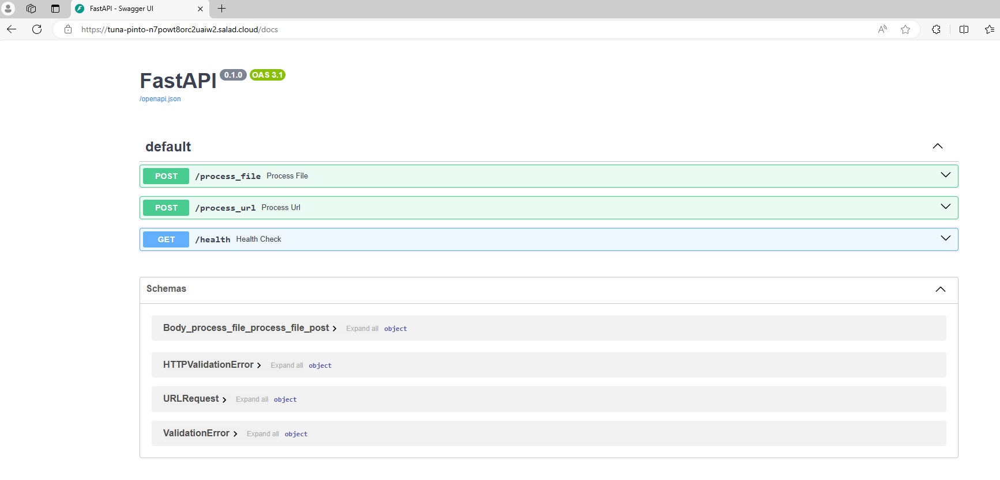

# YOLOv8 Object Detection API

## What This Recipe Does

This recipe creates an inference API for object detection using the YOLOv8 model. The API can process image and video files, as well as YouTube video URLs (non-live streams). Inference is powered by YOLOv8, exposed via a simple HTTP API. Users can make an HTTP request to the provided endpoints and get back object detections in JSON format.

### Key Features:
Object detection for images and videos.
Supports YouTube URL processing for video detection.
Scalable across multiple instances to handle heavy workloads.
JSON output with object labels, bounding boxes, and timestamps (for videos).

## How To Use This Recipe

### Authentication
This API does not require authentication by default, but it can be enabled by enabling authentication in the container gateway. If authentication is enabled, all requests will need to include your Salad API key in the header Salad-Api-Key. See the [Documentation](https://docs.salad.com/container-engine/gateway/sending-requests#authenticated-requests) for more information about authentication.

### Replica Count
By default, the recipe is configured for 3 replicas, and we recommend using at least 3 nodes. Salad’s distributed GPU cloud is powered by idle gaming PCs around the world, which means nodes can be interrupted without warning (e.g., due to a machine being used for gaming). To ensure uptime during interruptions, over-provision your resources slightly beyond your expected needs.

### Logging
You can view logs directly from the Salad portal to facilitate testing and development. For production workloads, connect an external logging source such as Axiom during container group creation to monitor logs effectively.

### Deploy It And Wait
When you deploy this API, Salad will allocate the desired number of qualified nodes, and the process of downloading the container image will begin. Depending on network conditions, downloading the container image may take several minutes. Once the nodes are up, the instances will enter the running state, showing a green checkmark in the “Ready” column. The API is ready to serve traffic once at least one instance is running, though you may want to wait until more nodes are active for production workloads.


### Visit The Docs
Once at least one instance is running, you can navigate to the /docs endpoint at the Access Domain Name provided in the portal. In the above example that URL is https://tuna-pinto-n7powt8orc2uaiw2.salad.cloud/docs . You’ll see the swagger documentation that looks something like this:



### API Endpoints
- `GET /health` - A health check endpoint that indicates whether the server is up and running. Useful for monitoring the server's status.
- `POST /process_file` - This endpoint processes image or video files for object detection.
**Request**
file: The image or video file, uploaded as form data.

```bash
curl -X POST "https://tuna-pinto-n7powt8orc2uaiw2.salad.cloud/process_file" \
  -F "file=@/path/to/image.jpg"
```
**Response**
A JSON object with object labels, bounding boxes, and timestamps (for videos).

```bash
[
  {
      "name": "person",
      "class": 0,
      "confidence": 0.86155,
      "box": {
        "x1": 31.14127,
        "y1": 69.07544,
        "x2": 267.50793,
        "y2": 335.46057
      }
    }
]
```
- `POST /process_url` - This endpoint processes a YouTube video URL for object detection.

**Request**
url: The YouTube video URL provided in the JSON body.

```bash
curl -X POST "https://tuna-pinto-n7powt8orc2uaiw2.salad.cloud/process_url" \
  -H "Content-Type: application/json" \
  -d '{"url": "https://www.youtube.com/watch?v=example"}'
```

**Response**
A JSON object with object labels, bounding boxes, and timestamps for the detected objects in the video.

```bash
[
 {
    "name": "person",
    "class": 0,
    "confidence": 0.95142,
    "box": {
      "x1": 0.48842,
      "y1": 145.05518,
      "x2": 499.85767,
      "y2": 1277.97876
    },
    "timestamp": 0.13357753357753357
 }
]
```

## Workload Customizations
### Hardware Considerations
For optimal performance, we recommend using a GPU with at least 12 GB VRAM for video processing workloads. YOLOv8 is optimized to run on a variety of hardware, but for high-volume workloads 12+ GB cards will be preferable. Note that request times out is 90 seconds. If you need to process long videos you might need to use bigger GPU or integrate storage account to save results. If you only need to process pictures, or videos frame by frame you can use a smaller gpu 

### Custom Models
On default we are using the medium yolo model. You can extend the API by using custom YOLOv8 models or other versions of pretrained yolo model. Replace the default yolov8m.pt with your custom model file in the Docker image, and ensure the model path/name is updated in the inference script. You can push your new image to your container registry and update your container group configuration to reference this new model.

### Scaling for Production
For production, we recommend setting the replica count to 5 or more to ensure coverage in case of node interruptions. Salad’s infrastructure ensures that your workloads are distributed across multiple GPU nodes, and interruptions are handled smoothly.

## Performance
### Default Configuration
Hardware: RTX 3080TI with 12 GB VRAM
System RAM: 8 GB
vCPU: 8 vCPUs
